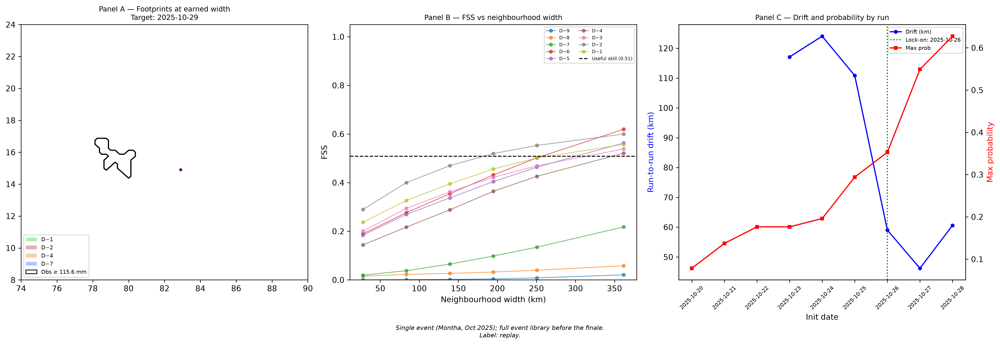

# Resolve

**Earned-resolution ensemble tracking for extreme rain and cyclones.**

Resolve post-processes ECMWF ensemble forecasts to answer a specific question: *at what spatial scale is this forecast actually skilful?* It tracks an extreme-rain event across 10 successive daily runs, quantifies where skill is earned using the Fractions Skill Score, and draws the event footprint only as finely as that skill permits — no false precision.

Built for NCMRWF/IMD as part of Smart India Hackathon 2026 (PS 26078, MoES).

---

## The problem

Operational ensemble forecasts are produced at 0.25° (~28 km at the equator). At long lead times, that resolution is meaningless — the ensemble is diffuse and a sharp footprint implies skill that doesn't exist. Forecasters either smooth manually (subjective) or show raw probabilities that look confident but aren't (misleading). There's no principled way to choose the display scale.

**Resolve's answer:** compute the Fractions Skill Score for the event at neighbourhood scales from ~28 km to ~362 km, find the coarsest scale where FSS clears the "useful skill" threshold, and call that the *earned width*. Draw footprints at that width only. As successive runs improve, the earned width naturally sharpens.

---

## Result: Cyclone Montha (Oct 2025)

The D-6 run (6 days before landfall) was the first to show useful skill, but only at a 362 km neighbourhood scale. Two days out, the width tightened to 195 km. Lock-on — when successive forecasts stopped drifting — occurred on 26 October, three days before landfall near Kakinada.



*Panel A: Forecast footprints from D-6, D-4, D-2 and D-1 runs, each drawn at its earned width, with the observed ≥ 115.6 mm contour. Panel B: FSS vs. window size by lead, with the useful-skill threshold. Panel C: Run-to-run drift and ensemble probability, with lock-on marked.*

---

## How it works

```
ECMWF IFS ENS (51 members, 0.25°, 0–360 h)
        │
        ▼ ingest.py — subset → local Zarr cache
        │
        ├──▶ accum.py — rate (kg m⁻² s⁻¹) → 24 h mm, window ending at 03 UTC
        │
        ├──▶ exceedance.py — per-member masks at 64.5 / 115.6 / 204.5 mm
        │
        ├──▶ objects.py — 8-connected components, rain-weighted centroids,
        │               cos-lat area (km²), bounding boxes
        │
        ├──▶ fss.py — land-masked neighbourhood FSS at 6 window sizes
        │           (n = 1, 3, 5, 7, 9, 13 cells ≈ 28–362 km)
        │
        ├──▶ earned.py — smallest n with FSS ≥ 0.5 + f_obs/2 per lead
        │
        ├──▶ crossrun.py — Hungarian matching across 10 successive runs
        │               (cost = 1 − IoU, gated by centroid distance)
        │
        └──▶ hero.py — 3-panel figure + summary.json + provenance sidecars
                            │
                            ▼ export_ui.py
                       ui/data/montha.js
                            │
                            ▼ ui/index.html (vanilla JS, offline-capable)
                       interactive replay console
```

Every output file gets a `.provenance.json` sidecar: dataset IDs, init times, thresholds, git commit, access time. Outputs carry a `replay` or `live` label. The 5 km downscaling phase (not yet built) would label its output `scenario`.

---

## Technical notes

**Exact window alignment.** IMD's rain day D is the 24 h ending at 03 UTC on D. The pipeline accumulates IFS ENS steps to match exactly, validates that each window covers exactly 86 400 s of forecast, and flags the −3 h offset for leads > 144 h (where 6-hourly steps are the finest available). This was empirically verified against five coastal AP/Odisha stations during Montha (DECISIONS.md D-008).

**Land-masked FSS.** Standard FSS breaks at coastlines: sea pixels are NaN and the uniform-filter denominator collapses. The implementation recomputes fractions as `uniform_filter(x·mask) / uniform_filter(mask)` on both forecast and observation, using the same land mask. This prevents coastal cells from being systematically over- or under-scored.

**Hungarian run-to-run matching.** At each lead the pipeline matches event objects across consecutive runs using the Hungarian algorithm on a cost matrix of `1 − IoU`. Pairs more than 500 km apart are forbidden. This gives an unambiguous drift series (km per day) and per-run IoU. Lock-on is the first run from which drift ≤ 100 km and IoU ≥ 0.5 hold continuously — a single, reproducible criterion with no human judgement.

**Sanity gate at 2 000 mm.** The D-5 run for Montha produced a 1 136 mm/24 h cell over the Andhra coast in one member — physically possible (the La Réunion record is 1 825 mm) but flags the need to catch unit errors (mm/hr unconverted → > 86 000 mm). The gate is set above the plausible physical maximum, not at an arbitrary round number (DECISIONS.md D-006).

**Zero-dependency UI.** The dashboard is vanilla JS with no build step, no npm, no bundler. It runs from `file://` with data loaded via `<script>` tags. Fonts are bundled (IBM Plex, SIL OFL). The UI renders pre-computed results from `window.RESOLVE_DATA`; it does no science. This means it works offline and can be deployed anywhere — including Vercel as a static site.

---

## Dashboard

The UI is a replay console: step through 10 daily runs, toggle between earned-scale tiles and raw 0.25° ensemble, overlay observed rain, and inspect the FSS curve.

| Key | Action |
|-----|--------|
| `← →` | Previous / next run |
| `Space` | Play / pause replay |
| `E` / `R` | Earned-scale tiles / raw ensemble |
| `O` | Toggle observed rain overlay |
| `Z` | Cycle zoom levels |

The map renders SVG tiles at the earned width for the selected lead. The FSS panel shows each run's skill curve with the useful-skill threshold and the earned-width marker.

---

## Project structure

```
sih078/
├── src/resolve/
│   ├── __main__.py      # CLI: hero, inspect, export-ui, ui
│   ├── config.py        # YAML → dataclasses (no Pydantic)
│   ├── provenance.py    # .provenance.json sidecars
│   ├── ingest.py        # IFS ENS → Zarr cache
│   ├── truth.py         # IMD gridded + IMERG V07
│   ├── accum.py         # rate → 24 h mm, window alignment
│   ├── exceedance.py    # per-member threshold masks
│   ├── objects.py       # 8-conn components, cos-lat area
│   ├── fss.py           # land-masked neighbourhood FSS
│   ├── earned.py        # earned width from FSS table
│   ├── crossrun.py      # Hungarian run-to-run matching
│   ├── hero.py          # orchestrator, figure, summary.json
│   └── export_ui.py     # outputs → ui/data/*.js
├── ui/                  # dashboard (HTML + JS, no build step)
├── tests/               # 8 modules, synthetic arrays only
├── configs/             # montha.yaml, default.yaml
├── notebooks/           # 01_montha_hero.ipynb (Colab-ready)
├── docs/
│   ├── DECISIONS.md     # 8 architecture decisions with rationale
│   └── assets/          # hero figure (300 dpi PNG)
└── outputs/montha/      # generated, not tracked (gitignored)
```

---

## Getting started

```bash
# 1. Install (Python 3.11+)
pip install -e .
pip install -e ".[plot]"   # optional: cartopy for coastlines

# 2. Set Earthdata credentials (for IMERG; optional for IMD-only runs)
# export EARTHDATA_USER=...
# export EARTHDATA_PASSWORD=...
# or add to ~/.netrc

# 3. Run the Montha hero figure
python -m resolve hero --config configs/montha.yaml

# 4. Export and serve the dashboard
python -m resolve export-ui --config configs/montha.yaml
python -m resolve ui   # opens http://localhost:8765
```

The Colab notebook (`notebooks/01_montha_hero.ipynb`) runs the full pipeline end-to-end without local data; it installs the repo, downloads all data, and produces the figure.

**What you need to run locally:**
- An ECMWF IFS ENS dynamical.org API key (free tier sufficient for one init)
- ~2 GB disk for the Zarr cache (one full init, subsetted to 8–24°N, 74–90°E)
- IMD gridded archive or live access (imdlib handles both)

---

## Status

| Phase | Description | Status |
|-------|-------------|--------|
| 0 | Repo skeleton, config, provenance, tests | Complete |
| 1 | Montha hero figure — ingest, FSS, earned width, dashboard | Complete |
| 2 | Event library, skill tables over full archive, bootstrap CI | Planned |
| 3 | GNN calibrator (PyTorch Geometric), XGBoost baseline | Planned — GPU required |
| 4 | FastAPI endpoints, CAP 1.2 XML drafts, live dashboard | Planned |
| 5 | 5 km downscaling (CorrDiff-Mini, exact conservation) | Optional — GPU |

Phase 1 is a single-event point estimate on Cyclone Montha. Phases 2–3 build the full event library and calibrator needed before general conclusions can be drawn.

---

## Data sources

| Source | What | Licence |
|--------|------|---------|
| [ECMWF IFS ENS](https://www.ecmwf.int/en/forecasts/datasets/open-data) via [dynamical.org](https://dynamical.org) | 51-member ensemble, 0.25°, 0–360 h | CC BY 4.0 + ECMWF terms |
| IMD 0.25° daily gridded rainfall ([imdlib](https://github.com/iamsaswata/imdlib)) | Ground truth, land-only | IMD open data |
| [GPM IMERG V07](https://gpm.nasa.gov/data/imerg) (NASA GES DISC) | Satellite truth, 0.1° | NASA open data |
| [IBTrACS v04r01](https://www.ncei.noaa.gov/products/international-best-track-archive) (NCEI) | Cyclone tracks | Public domain |

---

## License

MIT — see [LICENSE](LICENSE).
